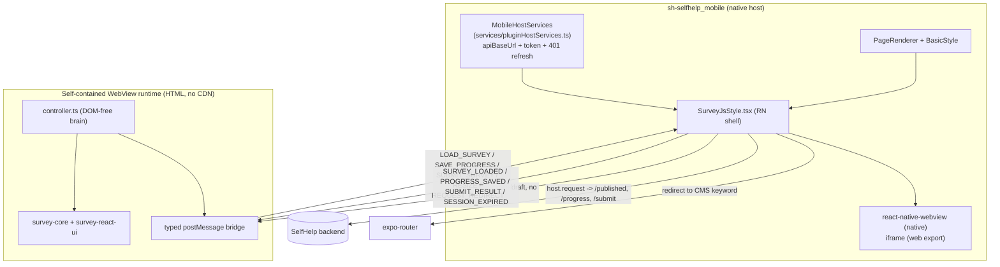

<!--
SPDX-FileCopyrightText: 2026 Humdek, University of Bern
SPDX-License-Identifier: MPL-2.0
-->

# SurveyJS Mobile Architecture (WebView)

Audience: Plugin developers and technical operators.
Status: active.
Applies to: `@selfhelp/sh2-shp-survey-js-mobile` >= 0.3.0 (mobile renderer contract `MOBILE_RENDERER_VERSION` 0.2.0).
Last verified: 2026-06-24.
Source of truth: `mobile/src/`, the WebView runtime bundle, `@selfhelp/shared` `plugin-sdk`, and the host `sh-selfhelp_mobile`.

The mobile renderer hosts the **official SurveyJS web runtime**
(`survey-core` + `survey-react-ui` — the same library the web frontend
uses) inside an **isolated, self-contained WebView**, driven by a typed
`postMessage` bridge. There is no native reimplementation of the survey
UI, so mobile has full parity with web (same JSON, question types,
validation, conditional logic, completion, redirect).

The core rule: **the WebView renders SurveyJS and owns the UI
lifecycle, but it does NOT own authenticated network access.** The
native host performs every protected API call (load / progress /
submit) with token + 401-refresh + session-expiry handling. The WebView
never sees the access token.

## Components

| Layer | File | Responsibility |
|-------|------|----------------|
| RN shell | `mobile/src/styles/SurveyJsStyle.tsx` | Hosts the WebView, answers bridge intents by calling host services, renders loading / error / retry / session-expired chrome, sizes the WebView, handles redirect. |
| Native transport | `mobile/src/styles/transport/SurveyWebViewNative.tsx` | `react-native-webview` on iOS/Android; loads the HTML via `source={{ html }}`. |
| Web transport | `mobile/src/styles/transport/SurveyWebViewWeb.tsx` | Sandboxed `<iframe srcDoc>` on the Expo web export. |
| Transport contract | `mobile/src/styles/transport/contract.ts` | Shared `IWebViewTransportProps`; the shell picks a transport by `Platform.OS` and lazy-`require`s it. |
| API client | `mobile/src/api/surveys.ts` | Wraps `/published`, `/progress`, `/submit` over `IMobileHostServices.request` (no direct `fetch`, no token). |
| Runtime brain | `mobile/src/runtime/controller.ts` | DOM-free SurveyJS lifecycle controller; emits intents, reacts to host results. Unit-tested headless against real `survey-core`. |
| Lifecycle helpers | `mobile/src/runtime/lifecycle.ts` | Pure helpers (enforce payload, schedule check, response id) mirroring the web frontend runtime. |
| WebView app | `mobile/src/webview/runtime/SurveyWebviewApp.tsx` | Browser-side React app that mounts `survey-react-ui` and wires the bridge + controller. |
| WebView HTML | `mobile/src/webview/generated/runtimeHtml.ts` | GENERATED single self-contained HTML (SurveyJS JS + CSS inlined). Built by `npm run build:webview`. |
| Host services | `sh-selfhelp_mobile/services/pluginHostServices.ts` | The host's `IMobileHostServices` implementation backed by the app's axios `getApiClient()` (baseURL + bearer token + single 401-refresh retry). Registered at boot in `providers/NativeBootstrap.tsx`. |

## Typed bridge protocol

Both sides validate **every** inbound message against the expected
shape and drop anything else (no `eval`, no trusting arbitrary data).

- WebView → host (intents + UI signals): `READY`, `LOAD_SURVEY`,
  `SAVE_PROGRESS`, `SUBMIT_SURVEY`, `RESIZE`, `REQUEST_REDIRECT`,
  `RUNTIME_ERROR`, `UNSUPPORTED`.
- host → WebView (results + inputs): `INIT` (theme/locale/draft, **no
  token**), `SURVEY_LOADED`, `PROGRESS_SAVED`, `SUBMIT_RESULT`,
  `SESSION_EXPIRED`, `SET_LOCALE`, `RETRY`.

The host owns token + 401-refresh + session-expiry entirely; the
WebView neither sees the token nor performs a refresh.

## Auth / network decision

All protected calls go through the native host-services bridge
(`@selfhelp/shared` `set/getMobileHostServices`):

- `apiBaseUrl()` — current server base URL (from the host server store).
- `getAccessToken()` — read-only, for non-sensitive bootstrapping; the
  WebView never receives it.
- `request(req)` — performs the authenticated call and returns a typed
  `IMobileHostResponse` (`ok`, `status`, `data`, `reason`, `error`,
  `sessionExpired`). 401 → host refresh → retry; if refresh fails,
  `sessionExpired: true`.

The host implementation reuses the app's axios client, so a plugin
request gets the same baseURL, `Authorization` bearer, `Accept-Language`,
`X-Client-Type: mobile`, and the single 401-refresh retry as every other
app call. Absolute URLs are rejected so a plugin cannot redirect a
token-bearing call off-origin.

`mobile/src/api/surveys.ts` maps each route:

- load → `GET plugins/sh2-shp-survey-js/surveys/published/{key}`
- progress → `PUT .../published/{key}/progress`
- submit → `POST .../published/{key}/submit`

Submission is identical to web — the backend
(`SurveysPublicController::submit()`) has **no preview/test/mobile
branch**, so a mobile (or mobile-preview) submit stores a real
`SurveyRun`. This is guarded by
`backend/tests/Service/SurveyResponseServiceTest.php`
(`testMobileOriginSubmitStoresRealRunAndIgnoresPreviewHints`).

## Self-contained runtime (no CDN)

`vite.webview.config.ts` bundles `src/webview` (React + `survey-react-ui`
+ `survey-core`, JS **and** CSS) and `scripts/wrap-webview-html.mjs`
inlines everything into one HTML string at
`src/webview/generated/runtimeHtml.ts`. `npm run build` runs
`build:webview` before `tsup`, so the published `dist` always carries the
real runtime. The committed `runtimeHtml.ts` is a tiny placeholder (kept
small so the repo stays light and `tsc`/vitest/tsup resolve before the
WebView is built); the multi-MB built version is never committed.

The HTML ships a strict CSP (`connect-src 'none'`) so the runtime
cannot reach the network — every authenticated call goes through the
native host.

## WebView security model

Enforced in the shell + transports and covered by tests:

- only the bundled/allow-listed origin loads (`originWhitelist` scoped to
  `about:blank` on native; sandboxed `srcDoc` iframe on web);
- no arbitrary navigation — `onShouldStartLoadWithRequest` blocks every
  navigation the shell did not explicitly allow;
- unknown external URLs are blocked; external redirects happen only via
  native host approval;
- only typed bridge messages matching the expected shape are accepted;
  everything else is dropped (`__tests__/bridge/messages.test.ts`).

## Compatibility / versioning (dual axis)

- `@selfhelp/shared` `MOBILE_RENDERER_VERSION` = `0.2.0` (adds the typed
  host-services bridge). The plugin sets `compatibility.mobile` to
  `^0.2.0` in `plugin.json` and keeps `reactNative` / `expoSdk` ranges.
- Bump the version together in `plugin.json` (`version`,
  `mobile.version`, `backend.composer.version`), `composer.json`,
  `mobile/package.json`, and `mobile/src/index.ts#PLUGIN_VERSION`.
- The host preview snapshot (`sh-selfhelp_mobile/web-preview/preview-plugins.json`)
  advertises `mobileRendererVersion: 0.2.0` and bundles the SurveyJS
  mobile package at the matching version.
- Fallbacks: a **missing/incompatible mobile package** → `OpenOnWebFallback`
  (the only legitimate open-on-web case). A **WebView load/runtime
  failure** → the HeroUI retry/error card. Unsupported question *types*
  stay inside the WebView with a documented degradation — never an
  open-on-web redirect.

## Tests

- Plugin package (vitest): typed bridge contract
  (`__tests__/bridge/messages.test.ts`), runtime controller driven by
  real `survey-core` (`__tests__/runtime/controller.test.ts`),
  host-services API client (`__tests__/api/hostApi.test.ts`), lifecycle /
  registration parity (`__tests__/renderer/`, `__tests__/parity/`).
- Backend (PHPUnit): mobile-origin submit stores a real run
  (`backend/tests/Service/SurveyResponseServiceTest.php`).
- Host (`sh-selfhelp_mobile`, node:test): host shared bridge availability
  + curated preview snapshot
  (`__tests__/unit/pluginHostServices.test.mjs`).

## Related

- [Plugin architecture](architecture.md)
- [Mobile guide (user)](../user/mobile-guide.md)
- [Publishing guide](../operations/publish.md)
